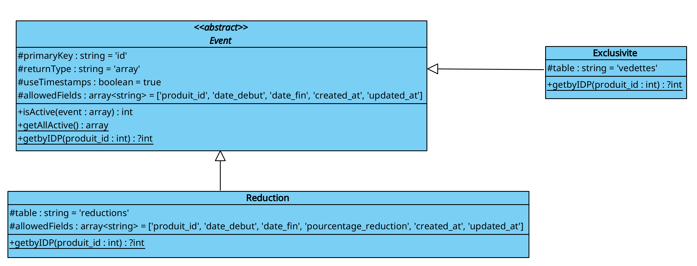
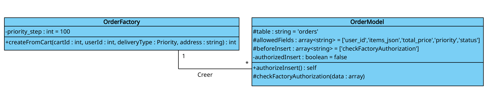
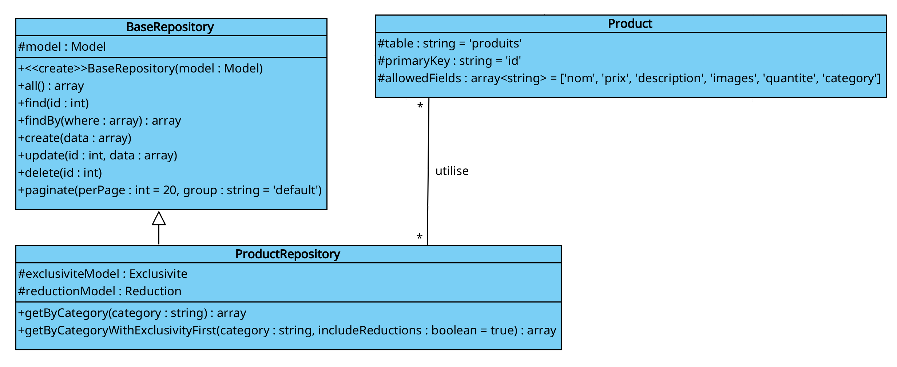

# Mini-rapport – Design Patterns

## Informations générales

- **Auteur(s)** :  Shawn Musset, Enzo Chelli, Esteban Fourage, Lilian Lucas
- **Projet / UE** :  Site dynamique de vente enligne

---

## Introduction

Ce mini-rapport présente **trois Design Patterns** utilisés dans le cadre du projet.  
Pour chacun d’eux, nous expliquons :
- le **pourquoi** (justification du choix),
- le **quoi** (principe et modélisation),
- le **comment** (implémentation concrète).

L’objectif est de démontrer la compréhension des patrons de conception et leur adéquation au problème posé.

---

# Design Pattern 1 – *Template*

## 1. Justification du choix (Pourquoi ?)

### Problème identifié
Dans le projet du site de vente en ligne, plusieurs types d’événements commerciaux s’appliquent aux produits, notamment les produits exclusifs et les réductions.
Ces événements partagent une logique globale commune, comme la gestion des périodes de validité, l’activation ou non de l’événement, et l’association à un produit donné.

Mais, chaque type d’événement possède également un comportement spécifique. Par exemple, une exclusivité ne se traite pas de la même manière qu’une réduction en pourcentage.

Sans une structure commune, cette logique aurait été dupliquée dans plusieurs classes, rendant le code plus difficile à maintenir et à faire évoluer.

### Pourquoi ce Design Pattern ?
Le Design Pattern Template Method est adapté  car il permet de définir la structure générale du traitement des événements dans une classe abstraite, tout en laissant certaines étapes être implémentées par les sous-classes.

Dans le projet, la classe abstraite Event définit le squelette du traitement d’un événement, tandis que les classes Exclusive et Reduction spécialisent les parties variables du comportement.

Ce patron garantit une cohérence dans le déroulement du traitement tout en autorisant des variations selon le type d’événement.
### Comparaison avec d’autres solutions
- **Avantages** :
  - Évite la duplication de code commun aux événements
  - Implique une structure claire et cohérente
  - Facilite l’ajout de nouveaux types d’événements
  - Respecte le principe Open / Closed
  
- **Inconvénients** :
  - Couplage entre la classe abstraite et les sous-classes
  - Moins flexible si la structure de l’algorithme doit changer fréquemment


Le Template Method a été préféré à une implémentation avec des conditions ou à une duplication de logique, car il impose une structure commune tout en restant simple et maintenable.

---

## 2. Présentation du Design Pattern (Quoi ?)

### Description générale
Description générale
Le patron Template Method (Modèle Template) définit l'ossature d'un algorithme dans une méthode "template" fournie par une classe abstraite, tout en déléguant certaines étapes (opérations primitives) à des méthodes que les sous-classes implémentent. Il permet de factoriser la structure commune d'un processus et de laisser les variations aux classes concrètes.

### Rôles et responsabilités
- **Classe abstraite (Template)** : définit la méthode `templateMethod` qui orchestre l'algorithme et appelle des opérations primitives; peut fournir des implémentations par défaut.
- **Sous-classes concrètes (ConcreteTemplate)** : implémentent ou spécialisent les opérations primitives pour fournir le comportement spécifique.
- **Collaborateurs** : services ou objets auxiliaires utilisés par les étapes du template.

### Diagramme UML



---

## 3. Implémentation (Comment ?)

### Choix techniques
Pour l’implémentation du Template Method, nous avons choisi de créer une classe abstraite Event.

Cette classe regroupe tout ce qui est commun aux événements commerciaux tels que réduction, exclusivité :

- la gestion des dates de début et de fin,

- la vérification de l’activation d’un événement,

- la liaison avec un produit,

- l’utilisation de variable de log.

Les méthodes comme isActive, getAllActive ou getByIDP sont définies dans la classe abstraite, car leur fonctionnement global est identique quel que soit le type d’événement.
Les classes Exclusivite et Reduction héritent ensuite de Event et se contentent de préciser :

- la table associée

- les champs spécifiques

et, si nécessaire, de redéfinir certaines méthodes pour adapter le comportement (par exemple pour la gestion du pourcentage de réduction).

Ce choix permet de centraliser la logique commune tout en laissant de la liberté aux événements spécifiques.

### Extraits de code

```
abstract class Event extends Model
{
    protected $primaryKey    = 'id';
    protected $returnType    = 'array';
    protected $useTimestamps = true;
    protected $allowedFields = ['produit_id', 'date_debut', 'date_fin', 'created_at', 'updated_at'];


    public function isActive(array $event): int{ ..}

    public static function getAllActive(): array{...}

    public static function getbyIDP(int $produit_id): ?int{...}
}


class Exclusivite extends Event
{
    protected $table = 'vedettes';
}


class Reduction extends Event
{
    protected $table = 'reductions';
    protected $allowedFields = ['produit_id', 'date_debut', 'date_fin', 'pourcentage_reduction', 'created_at', 'updated_at'];
    public static function getbyIDP(int $produit_id): ?int
    {...}
}

  
```

### Adaptations éventuelles
Dans notre projet, le Template Method n’est pas utilisé sous la forme d’une unique méthode « template » stricte, mais plutôt comme une structure commune partagée par plusieurs méthodes.

Cette adaptation est volontaire et liée au fonctionnement du framework utilisé.
Plutôt que de forcer une seule méthode centrale, nous avons préféré mutualiser les traitements communs dans la classe abstraite Event, tout en laissant les classes filles personnaliser uniquement ce qui diffère.

Cette approche rend le code plus lisible, plus simple à maintenir et plus facile à faire évoluer si de nouveaux types d’événements doivent être ajoutés par la suite.

# Design Pattern 2 – *Factory*

## 1. Justification du choix (Pourquoi ?)

### Problème identifié
La création d’une commande dans le site de vente en ligne dépend de plusieurs paramètres dynamiques : utilisateur, panier, adresse, type de livraison et priorité.
Ce processus de création implique plusieurs règles métier et étapes de préparation des données.

Créer directement une commande dans les contrôleurs ou les modèles aurait entraîné un fort couplage et une dispersion de la logique de création dans plusieurs parties du code.

### Pourquoi ce Design Pattern ?
Le Design Pattern Factory Method permet de centraliser la logique de création d’objets complexes dans une classe dédiée.

Dans le projet, la classe OrderFactory est responsable de la création des instances de OrderModel à partir des informations du panier et des choix de l’utilisateur.
Les autres composants du système utilisent la factory sans connaître les détails de construction de la commande.

Ce patron améliore la lisibilité du code et facilite l’évolution du processus de création des commandes.

### Comparaison avec d’autres solutions
- **Avantages** :
  - Centralisation de la logique de création
  - Réduction du couplage entre les classes
  - Facilite l’ajout de nouveaux modes de création
  - Code plus clair et maintenable
- **Inconvénients** :
  - Augmentation du nombre de classes
  - Légère complexité supplémentaire

La Factory Method a été préférée à l’instanciation directe des objets, car elle offre une meilleure évolutivité et une meilleure séparation des responsabilités.

---

## 2. Présentation du Design Pattern (Quoi ?)

### Description générale
Description générale
Le patron Factory (Factory Method) encapsule la création d'objets dans une méthode dédiée afin de découpler le code client des classes concrètes instanciées. La responsabilité de la création est déléguée à des sous-classes ou à des créateurs spécialisés qui retournent des produits conformes à une interface commune.

### Rôles et responsabilités
 - **Créateur (Creator / Factory)** : déclare l'interface de la méthode de création (`createProduct`) et peut définir un comportement par défaut.
 - **Créateurs concrets (ConcreteCreator)** : implémentent la méthode de création pour instancier et retourner des `Product` concrets.
 - **Produit (Product)** : interface ou classe abstraite représentant l'objet créé.
 - **Produits concrets (ConcreteProduct)** : implémentations concrètes fournies par la factory.

### Diagramme UML



---

## 3. Implémentation (Comment ?)

### Choix techniques
La création d’une commande étant un processus relativement complexe, nous avons décidé de centraliser toute cette logique dans la classe OrderFactory.

La méthode createFromCart prend en paramètres les informations nécessaires (panier, utilisateur, adresse, type de livraison) et s’occupe de :

- parcourir les éléments du panier

- calculer le prix total

- préparer les données des produits sous forme de JSON

- déterminer automatiquement la priorité de la commande

- enregistrer la commande en base de données.

Le stockage des items sous forme de JSON a été choisi car les opérations sur ces données sont limitées (principalement de la lecture), ce qui simplifie la structure et évite des jointures inutiles.

Les contrôleurs n’ont donc plus qu’à appeler la factory, sans se soucier des détails de création d’une commande.

### Extraits de code

```
class OrderFactory
{
    public static function createFromCart(
        int $cartId,
        int $userId,
        string $address,
        Priority $deliveryType = Priority::STANDARD  
    ): int {
      
        $total = 0;
        $jsonItems = [];
        // Calcule le total et prépare les items au format JSON pour simplifier le stockage car très peu d'opérations seront faites dessus
        foreach ($items as $item) {
            $lineTotal = $item['price_at_add'] * $item['quantity'];
            $total += $lineTotal;

            $jsonItems[] = [
                'product_id' => $item['product_id'],
                'quantity'   => $item['quantity'],
                'unit_price' => $item['price_at_add'],
                'total'      => $lineTotal
            ];
        }

    // Déterminer la priorité automatiquement (sauf point relais)
        if ($deliveryType === Priority::RELAIS) {
            $deliveryType = Priority::RELAIS;
        } elseif ($total >= self::PRIORITY_STEP) {
            $deliveryType = Priority::PRIORITAIRE;
        } else {
            $deliveryType = Priority::STANDARD;
        }

//on enregistre en DB
$orderModel->authorizeInsert();
        $order = $orderModel->insert([
            'user_id'     => $userId,
            'items_json'  => json_encode($jsonItems),
            'total_price' => $total,
            'priority'    => $deliveryType->value,
            'status'      => OrderStatus::EN_ATTENTE->value
        ]);
    }
    return $order['id'];
```

### Adaptations éventuelles
La Factory Method a été adaptée à notre contexte en prenant la forme d’une méthode statique, ce qui simplifie son utilisation dans les contrôleurs.

Nous n’avons pas mis en place de hiérarchie de factories, car une seule manière de créer une commande est nécessaire pour le projet.
Ce choix permet de garder une implémentation simple et lisible, tout en respectant l’objectif principal du patron : séparer la logique de création du reste de l’application.

# Design Pattern 3 – *Repository*

## 1. Justification du choix (Pourquoi ?)

### Problème identifié
Dans le diagramme de classes, l’accès aux données persistantes est centralisé autour des classes Model représentant les tables de la base de données (UserModel, Product, OrderModel, CartModel, etc.).
Cependant, certaines entités, notamment les produits, nécessitent des opérations d’accès plus complexes que de simples lectures ou écritures standards, comme la récupération par catégorie, la gestion des produits exclusifs ou l’application de réductions.

Sans couche dédiée, cette logique d’accès aux données aurait été placée directement dans les contrôleurs ou dispersée dans plusieurs modèles, entraînant une forte dépendance à la structure de la base de données et une perte de lisibilité.

### Pourquoi ce Design Pattern ?
Le Design Pattern Repository est utilisé pour isoler et regrouper la logique d’accès aux données complexes dans des classes dédiées.

Dans le diagramme, ce patron est concrètement représenté par :

la classe BaseRepository, qui définit les opérations génériques d’accès aux données et la classe ProductRepository, qui hérite de BaseRepository et implémente des requêtes spécifiques aux produits.

Les contrôleurs utilisent ces repositories pour interagir avec les données, sans dépendre directement des modèles ni des détails de persistance.

### Comparaison avec d’autres solutions
- **Avantages** :
  - Centralisation de la logique d’accès aux données
  - Réduction du couplage entre contrôleurs et modèles
  - Meilleure lisibilité du code
  - Facilite la maintenance et les évolutions futures
- **Inconvénients** :
  - Ajout d’une couche supplémentaire dans l’architecture
  - Risque de duplication si mal structuré

Le Repository a été préféré à un accès direct aux modèles depuis les contrôleurs, car il permet de structurer clairement l’accès aux données, notamment pour les requêtes spécifiques aux produits, tout en conservant une architecture propre et évolutive.

## 2. Présentation du Design Pattern (Quoi ?)

### Description générale
Description générale
Le patron Repository fournit une couche d'abstraction entre la logique métier et la persistance des données. Il offre une interface de type collection (find, add, update, remove) permettant de récupérer et manipuler des entités métier sans exposer les détails d'accès aux données (ORM, requêtes SQL, API externes).

### Rôles et responsabilités
 - **Interface Repository** : définit les opérations disponibles pour accéder et modifier les entités (ex : `findById`, `findAll`, `save`, `delete`).
 - **Implémentation concrète** : réalise les opérations en communiquant avec la source de données (base, ORM, service externe) et mappe les résultats en entités métier.
 - **Entités / Domain Models** : objets métiers manipulés par le repository.
 - **Source de données / Unit of Work (optionnel)** : gère la connexion et les transactions si nécessaire.

### Diagramme UML




## 3. Implémentation (Comment ?)

### Choix techniques
Nous avons introduit une couche Repository afin de séparer clairement l’accès aux données de la logique métier et des contrôleurs.

La classe BaseRepository contient les opérations génériques (find, findAll, create, update, delete) et repose sur un modèle CodeIgniter injecté via le constructeur.
Les repositories spécifiques, comme ProductRepository, héritent de cette classe et ajoutent uniquement les méthodes propres à leur domaine (recherche par catégorie, gestion des produits exclusifs, etc.).

Les contrôleurs interagissent donc uniquement avec les repositories, sans dépendre directement des modèles ni de la structure de la base de données.

### Extraits de code

```
class BaseRepository
{
    protected $model;
    
public function __construct(Model $model)
    {
        $this->model = $model;
    }

    public function all(): array
    {
        return $this->model->findAll();
    }

    public function find($id)
    {
        return $this->model->find($id);
    }

    public function findBy(array $where): array
    {
        return $this->model->where($where)->findAll();
    }

    public function create(array $data)
    {
        return $this->model->insert($data);
    }

    public function update($id, array $data)
    {
        return $this->model->update($id, $data);
    }

    public function delete($id)
    {
        return $this->model->delete($id);
    }

}
```

### Adaptations éventuelles
Le Repository a été adapté à l’architecture du projet en s’appuyant sur les modèles fournis par le framework, plutôt que de recréer des entités métier séparées.

Cette approche permet de :

- limiter la complexité

- éviter une surcouche inutile

- rester cohérent avec les conventions du framework.

Le patron est ainsi utilisé de manière pragmatique, en apportant une vraie valeur ajoutée sur les accès complexes aux données, sans alourdir l’architecture globale.
