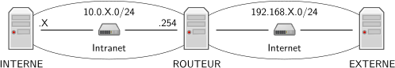

# R3.06 SAÉ Architectures des réseaux

[[_TOC_]]

## Présentation du sujet
Cette SAÉ aura pour objectif de : 
- configurer un réseau comportant un VLAN ;
- d'installer, configurer et déployer plusieurs services.

## Modalités
- le travail est à réaliser en groupe de projet
- l'évaluation sera faite par votre enseignant référent lors de la dernière séance
- vous préparerez un fichier au format md décrivant la mise en place de votre architecture

## Travail à réaliser
Vous trouverez ci-dessous un schéma de l’organisation minimale du réseau que vous aurez à mettre en place. Vous choisirez vos noms de machines qui remplaceront `ROUTEUR`, `INTERNE` et `EXTERNE`. 

### DNS
Choisissez un nom de domaine dans `.com`. Votre serveur DNS gérera a minima les noms suivants : `ROUTEUR`, `www` qui sera un alias d'une autre machine. Vous fournirez également la procédure et le(s) fichier(s) pour faire une délégation depuis le serveur de `.com` ou (mieux) vous gérerez vous même une deuxième zone DSN déléguée.

### VLAN
Mettez en place un VLAN sur la partie privée de votre réseau.

### DHCP
Installez et configurez un serveur DHCP. Celui-ci fournira une route par défaut vers la machine ROUTEUR, le nom de domaine, et l’IP du serveur DNS. L'hôte INTERNE doit se voir délivrer une adresse fixe en fonction de son adresse MAC.

### HTTP
Installez et configurez un serveur HTTP sur INTERNE. Ce serveur doit répondre sur le port 80 et être accessible via `http://ROUTEUR:8080` depuis EXTERNE.
Enfin, vous y reproduirez la configuration MVC des TPs de R3.01 (avec sqlite comme SGBD).

### Autre
Vous pouvez compléter votre configuration par les éléments de votre choix (filtrage, services supplémentaires, mise en place d'une DMZ, plus de réseaux/machine avec routage dynamique, ...) 
